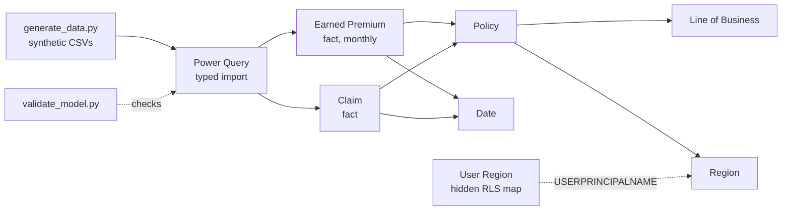

# Insurance Claims Analytics — Power BI Semantic Model (TMDL)

> **Representative portfolio project.** Written independently on synthetic data. It is not client code, does not reproduce any employer's model, and contains no real policy, claim, or personal data.

A property & casualty insurance semantic model kept as source code: a star schema, 18 documented DAX measures, dynamic row-level security, and a CI check that fails the build when a measure references a column that does not exist.

## Business problem

Underwriting, claims, and finance teams often report loss ratio from different spreadsheets and get different answers. This model gives them one certified definition of earned premium, incurred loss, loss ratio, severity, frequency, and claim cycle time, and limits each regional manager to their own region's data.

## What this demonstrates

| Skill | Where to look |
|---|---|
| Star-schema modeling (Kimball) | `ClaimsAnalytics.SemanticModel/definition/relationships.tmdl` |
| DAX: time intelligence, `USERELATIONSHIP` on inactive relationships, `DIVIDE`, iterators | `definition/tables/*.tmdl`, [`docs/measures.md`](docs/measures.md) |
| Dynamic RLS with `USERPRINCIPALNAME()` | `definition/roles/Regional Manager.tmdl` |
| Power Query (M) parameterized sources | `definition/expressions.tmdl`, table partitions |
| Power BI Projects / TMDL for Git-based development | whole `ClaimsAnalytics.SemanticModel` folder |
| Data validation and reconciliation | `src/validate_model.py`, `docs/reference_kpis.csv` |
| CI for BI assets | `.github/workflows/ci.yml` |

## Architecture



| Table | Grain | Rows (default seed) |
|---|---|---|
| Earned Premium | policy × month | 60,000 |
| Claim | claim | ~1,100 |
| Policy | policy | 5,000 |
| Line of Business, Region, Date, User Region | dimension | small |

## Key measures

| Measure | Definition |
|---|---|
| Loss Ratio | Incurred Loss ÷ Earned Premium Amount |
| Incurred Loss | Paid Loss + Case Reserve Amount |
| Average Severity | Incurred Loss ÷ Claim Count |
| Claim Frequency per 100 Policies | Claim Count ÷ Policy Count × 100 |
| Claims Reported | Claim Count on report date via `USERELATIONSHIP` |
| Earned Premium YoY % | vs `SAMEPERIODLASTYEAR` |
| Avg Days to Close | report → close, closed claims only |

Full catalog with DAX: [`docs/measures.md`](docs/measures.md).

## Quick start

```bash
git clone https://github.com/samarthass00/insurance-claims-powerbi-semantic-model.git
cd insurance-claims-powerbi-semantic-model
python -m venv .venv && source .venv/bin/activate   # Windows: .venv\Scripts\activate
pip install -r requirements.txt
python src/generate_data.py          # writes data/*.csv (seeded, reproducible)
python src/validate_model.py         # static model checks + docs/reference_kpis.csv
pytest -q
```

### Open in Power BI Desktop

1. Make sure Power BI Desktop saves projects as `.pbip` with the TMDL semantic model format (on older builds these are under **Options → Preview features**).
2. Create a new project, save it as `.pbip`, close Desktop, and replace the generated `*.SemanticModel/definition` folder with this repository's `definition` folder (or open the folder in Tabular Editor with TMDL support).
3. Set the `DataFolder` parameter to your local `data` path and refresh.
4. Compare the totals in a table visual against `docs/reference_kpis.csv`.

## Row-level security test

Model view → **Manage roles → View as → Regional Manager**, other user `west.manager@example.com`. Only the West region should remain, and Loss Ratio should equal the West row of a pandas group-by on the same data.

## Configuration and security

- The only configuration is the `DataFolder` parameter; there are no connection strings, credentials, or tenant IDs in the repository.
- All e-mail addresses use the reserved `example.com` domain.
- `.gitignore` excludes Power BI local settings and cache files (`.pbi/localSettings.json`, `cache.abf`).

## Limitations and next steps

- Earning is simplified to 1/12 of written premium per policy month; there is no IBNR, reinsurance, or accident-year triangle.
- The TMDL is hand-authored and checked by `validate_model.py`, which verifies references but not full DAX syntax. Run Tabular Editor's Best Practice Analyzer for deeper checks.
- Planned: a Power BI report (PBIR) with screenshots, calculation groups for time intelligence, an aggregation table for the monthly fact, and a Fabric Direct Lake version.

## License

MIT — see [LICENSE](LICENSE).
